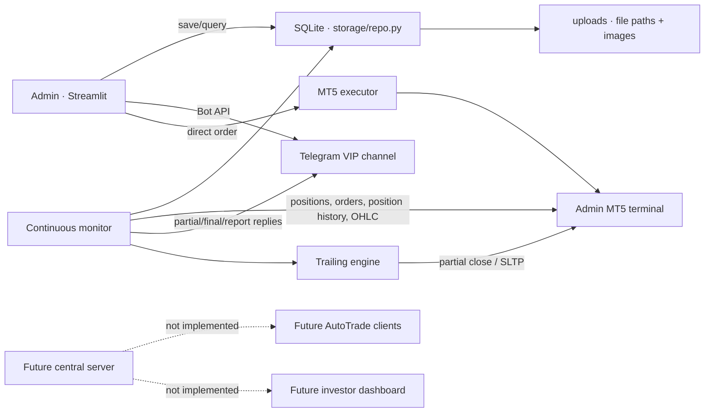
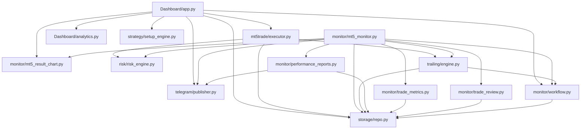

# NEXUS v0.9.20 architecture and reliability baseline

Original audit date: 2026-08-13. v0.9.20 adds stabilization controls without adding the central server, investor dashboard, remote client, or new trading strategies. No live order was sent during implementation.

## Executive summary

NEXUS is currently a two-process local application:

1. A Streamlit Admin Command Center publishes manual signals and can submit a direct MT5 order.
2. A continuous monitor owns lifecycle discovery, trailing actions, Telegram result replies, metrics/review generation, workflow audit, and scheduled reports.

SQLite and the uploads tree are the shared persistence layer. Telegram is an external publication side effect. MT5 is both the execution endpoint and authoritative trade-history source. The central server, investor application, remote AutoTrade client, and complete licensing platform are future components; only preliminary client/trailing policy tables and resolvers exist today.

The architecture retains the demo guard, position-ID deal history, NEXUS-only realized analytics, mixed-timestamp normalization, checklist/trailing snapshots, and reply-chain IDs. v0.9.20 adds durable signal/outbox intent, WAL-safe backup, schema versions, fake MT5 tests, explicit connection ownership, and trailing reconciliation. Controlled live MT5 validation remains required.

## v0.9.20 reliability additions

- `config_loader.py` isolates Telegram credentials from public JSON.
- `outbox` persists Telegram signal/lifecycle/report operations with deterministic keys and retry states.
- `schema_migrations` records repeat-safe database versions.
- `storage/backup.py` uses SQLite Backup API and validates integrity.
- `mt5trade/gateway.py` introduces real/fake MT5 adapters incrementally.
- Trailing actions now record an executing boundary and reconcile uncertain Partial/SL outcomes.
- Result Chart V2 accepts a shared MT5 instance and shuts down only owned connections.
- The System tab exposes operational reliability status without raw secrets.

## System map

## Runtime entry points

| Entry point | Purpose | Notes |
|---|---|---|
| `RUN_NEXUS.cmd` | Starts monitor in a second command window, then Streamlit | Window title still says v0.9.17. Uses `python -m streamlit`, which is correct. |
| `python -m streamlit run Dashboard/app.py` | Admin UI only | Does not guarantee the continuous monitor is running. |
| `MT5_MONITOR.py` | Calls `monitor.mt5_monitor.main()` | Uses a file lock to prevent a second continuous instance. |
| `MT5_MONITOR_ONCE.py` | One lifecycle/report pass | Does not acquire the continuous-monitor lock. Avoid concurrent use. |
| `MIGRATE_FROM_PREVIOUS.py` | Imports a sibling release DB and uploads | Interactive; main-DB file copy is not WAL-safe. |
| `BACKFILL_WORKFLOW.py` | Reconstructs audit events | Idempotent keys, but it mutates workflow audit. |
| `CHECK_*.py` | Operator diagnostics | Script-style checks, not assertions or automated tests. |
| `STOP_MONITOR.py` | Terminates PID from the local PID file | Operational/destructive; use deliberately. |

`monitor.enabled` is not consulted by the monitor entry point. Starting the script starts monitoring regardless of that flag.

## Module dependency map

The main concentration points are `Dashboard/app.py` (892 lines, UI plus orchestration) and `storage/repo.py` (1,089 lines, schema plus every repository). Importing `storage.repo` runs `migrate()` immediately, and most repository calls run it again.

## Operational flows

### Signal and MT5 execution

1. Admin enters signal, setup/checklist, targets/trailing, sizing, and image.
2. UI validates positive values, target ordering, and BUY/SELL geometry.
3. UI sends the image/card to Telegram first.
4. After Telegram succeeds, it saves the signal, trailing snapshot, checklist snapshot, and workflow events.
5. In MT5 mode, `MT5Executor` initializes the configured terminal and enforces account mode/trading permissions.
6. Risk engine evaluates kill switch, loss throttle, slot limits, unprotected positions, prop limits, and projected total risk.
7. Executor resolves configured or discovered broker symbol, sizes volume, chooses market/limit/stop, tries RETURN/IOC/FOK, and stores outcome.

Important gap: Telegram publication precedes durable local signal creation. A database/filesystem failure can leave a public signal without a recoverable NEXUS dossier. `save_signal()` uses `INSERT OR REPLACE`, so a reused NX-ID can replace an existing signal row.

### Telegram flow

- Signal: photo with caption, no reply parent.
- Partial/final: parent is `last_event_message_id`, falling back to original signal `telegram_message_id`.
- Generated chart is preferred; text is used if chart creation fails.
- On success, event and signal store message IDs, producing a chain.
- Reports are standalone text messages.

Important gap: Partial/Final events are inserted before the Bot API call. A send failure leaves the exit ticket marked processed, so the next poll does not retry publication. Reports have the inverse crash window: Telegram is sent before `report_runs` is saved, so a crash can duplicate the report.

### Monitoring and lifecycle flow

1. Every configured poll interval, the monitor initializes MT5 and records account heartbeat/risk state.
2. It loads `mt5_enabled` signals whose monitor state is not terminal.
3. It resolves a live position by stored position ID, ticket, or NEXUS comment; pending orders by ticket/comment.
4. It derives/resolves position ID and calls `history_deals_get(position=POSITION_ID)`.
5. If live, it runs trailing before detecting new exit deals, then records/publishes partial exits.
6. If no position/pending remains, it builds the final event from the full position deal chain, stores metrics, publishes result, and creates review/journal snapshots.
7. It checks scheduled daily/weekly reports and shuts down MT5.

The authoritative join is position ID. Deal magic/comment is not required after the position is known.

Observed runtime issue: an enabled signal with `NOT_REQUESTED`, no ticket, and no position is polled every two seconds and logs `cannot resolve MT5 position id` continuously. This is log flooding rather than a durable actionable workflow state.

### Trailing flow

- The per-signal plan freezes profile mode, parameters, targets, and creation time.
- LADDER checks target crossings, optionally performs TP1 partial, then moves SL to Entry/previous target.
- R-based executes configured trigger/lock stages and optional partials.
- Fixed-R and ATR modes ratchet continuous SL improvements.
- `trailing_actions.action_key` prevents replay after a recorded `DONE`; plan stage/status survive restart.
- MT5 responses and workflow events are recorded for successful actions.

Gaps requiring live-safe correction:

- A process crash after MT5 accepts a partial but before `DONE` is committed can resend it. Durable intent plus deal reconciliation is needed.
- Target crossing checks the current tick/current M1 candle only. After downtime/restart, an earlier target hit followed by retracement can be missed.
- Stop distance is checked, but freeze level is not explicitly checked.
- `trailing.enabled` is not a global runtime gate.
- Telegram management updates use normal lifecycle detection; the configured management-publication flag is not a complete independent contract.

### Strategy/checklist flow

- Setup definitions have editable active checklist items with weight, required flag, and order.
- At signal creation, `score_checklist()` embeds item ID, text, weight, required, and checked state in JSON.
- `signal_setup_scores` stores score, grade, rationale, and snapshot.
- Strategy analytics join closed NEXUS final events with snapshots for setup, band, and checked-vs-unchecked descriptions.

The content snapshot survives later template edits, but database immutability is not enforced: the row is an upsert keyed by signal ID. Grade thresholds in `config.json` and `require_checklist_to_publish` are not used by the scorer/publish-button logic; grades are hardcoded.

### Trade archive and journal flow

- The archive assembles the original signal image, lifecycle screenshots/result charts, manual result image, and uploaded archive records by stable path.
- The dossier shows signal/MT5/risk fields, setup snapshot, lifecycle, metrics, trailing actions, review, notes, and workflow.
- Final close computes M1 MAE/MFE/exit efficiency, then creates deterministic review and auto-journal snapshots.
- Media bytes remain outside SQLite; the database stores paths and metadata.

Paths are currently absolute/local and have no portability rebasing contract. Result Chart V2 plots levels plus the current event exit, but it does not plot the complete set of partial exits on the final image.

## Database schema summary

Current database facts at audit time: integrity check `ok`, WAL journal mode, `PRAGMA user_version = 0`, 20 application tables, and no declared foreign keys. Unique/primary-key constraints provide some idempotency, but there are no explicit relationship constraints and few query indexes beyond SQLite auto-indexes.

| Area | Tables | Purpose / key |
|---|---|---|
| Signal | `signals`, `results` | Core NX signal/execution state; manual result overrides. |
| Lifecycle | `trade_events` | Partial/final events; unique `event_key`, position/deal/message linkage. |
| Workflow | `workflow_audit` | Auditable stages; unique `event_key`. |
| Reporting | `report_runs`, `account_snapshots` | Restart duplicate key and account history. |
| Analytics/journal | `trade_metrics`, `trade_notes`, `trade_reviews`, `auto_journal` | One row per signal for derived metrics, notes, review, and snapshot. |
| Strategy | `setup_definitions`, `setup_checklist_items`, `signal_setup_scores` | Editable templates and per-signal checklist snapshot. |
| Media | `trade_archive_files` | File path/category/caption/source; unique signal/path pair. |
| Trailing | `trailing_profiles`, `signal_trailing_plans`, `trailing_actions` | Editable profiles, frozen signal plan, unique action intent/result. |
| AutoTrade policy | `autotrade_clients`, `client_trailing_policies` | Preliminary client expiry/enablement and trailing policy. |
| System | `system_state` | Heartbeat, risk state, manual kill switch. |

Schema evolution is implemented through `CREATE TABLE IF NOT EXISTS` plus additive `ALTER TABLE` columns inside `storage.repo.migrate()`. It has no ordered migration history, checksum, version gate, rollback marker, or validation report. Relationship constraints are absent. `MIGRATE_FROM_PREVIOUS.py` copies the prior main DB and uploads, backs up the destination main DB, then imports the repository and runs the additive migration.

Critical migration gap: the source and destination can be in WAL mode while only `NEXUS_DATA.db` is copied. Committed rows still resident in `-wal` can be omitted, and replacing a database while a monitor is active is unsafe. Use SQLite's backup API/checkpoint-aware process and require monitor shutdown/validation.

## Configuration reality

Implemented and actively used configuration includes MT5 terminal/account guard, symbol mappings, risk caps, monitor timing/publication, reporting schedule/timezone, analytics sessions, risk intelligence, prop mode, result-chart settings, and trailing defaults.

Known drift/dead contracts:

- `execution.enable_direct_mt5`, `execution.execute_by_default`, and `execution.telegram_only_default` do not control the current hardcoded UI default.
- `trading.dry_run` and duplicate `trading.account_mode` are not enforced by the executor.
- `monitor.enabled` and `trailing.enabled` are not runtime gates.
- `monitor.history_days`, legacy screenshot configuration, and `publisher.reply_result_to_signal` are stale or unused in the primary path.
- Strategy grade thresholds and required-checklist publication policy are configured but hardcoded/unenforced in code.
- `RUN_NEXUS.cmd` title is two versions behind.

Configuration should be validated centrally with explicit deprecation rather than silently ignored.

## Prioritized audit findings

### P0 — resolve before publishing or trusting unattended operation

1. **Credential exposure:** a real Telegram bot token is plaintext in `config.json`; no `.gitignore` or `.env.example` exists. Rotate it and move secret loading out of distributable config.
2. **Lost lifecycle delivery:** Partial/Final event deduplication is committed before Telegram success and has no outbox/retry state.
3. **Unsafe WAL migration:** previous-version migration copies only the main DB and does not coordinate with a running monitor.

### P1 — stabilization milestone

1. **MT5 session ownership:** result-chart generation initializes and shuts down MT5 inside the monitor's active MT5 pass, potentially invalidating later work such as scheduled reporting.
2. **Non-atomic signal publish:** public Telegram signal exists before the local signal/snapshots; reused signal IDs can be replaced through `INSERT OR REPLACE`.
3. **Trailing crash/restart gaps:** action success can precede durable recording; earlier target crossings can be missed after downtime; freeze level is not checked explicitly.
4. **Pending/unresolvable terminal states:** ticket/position fallback can poll indefinitely; canceled/expired pending orders are not robustly finalized.
5. **Report crash window:** Telegram send precedes report-run persistence, allowing duplicates after a crash.
6. **Configuration drift:** several safety/feature flags and grading/checklist policies are ignored.
7. **No test suite:** diagnostic scripts print state but assert nothing; zero automated tests were discovered.
8. **SQLite connection ownership:** repository functions use `with connection`, which commits/rolls back but does not itself close the connection. Temporary migration verification retained a Windows file handle until process exit; connections should be explicitly closed in the long-running processes.

### P2 — architectural debt

- UI/orchestration and schema/repository modules are large and tightly coupled; repository migration occurs as an import side effect and on nearly every call.
- No foreign keys, explicit schema version, migration ledger, or purpose-built indexes.
- Broad exception suppression can hide parsing/history/config errors; raw errors are inconsistently surfaced in workflow.
- Absolute media paths complicate installation migration.
- AutoTrade client records cover only a fraction of required subscription/risk/symbol/binding policy and have no authenticated transport.
- Investor/public authorization does not exist yet; hiding Streamlit controls would not be sufficient.
- Legacy window capture remains packaged/imported although the primary result path is OHLC rendering.

## Verification performed

### Static tested

- `python -m compileall -q .` passed on Python 3.14.7.
- Imports/packages reported Streamlit 1.61.1, requests 2.34.2, and MetaTrader5 5.0.6090.
- Repository/module dependency and fragile-pattern scans completed.
- `python -m unittest discover -v` discovered zero tests.

### Local tested

- SQLite `PRAGMA integrity_check` returned `ok`; schema and row counts were inspected read-only.
- A temporary legacy signals/results schema was migrated twice: the sample signal was preserved, current required tables appeared, and six default trailing profiles remained non-duplicated.
- `CHECK_TRAILING.py` and `CHECK_WORKFLOW.py` ran against the local installation.
- The continuous monitor was observed running; it was not stopped by the audit.

### MT5 live test required

- No order submission, pending fill/cancel, partial close, SL modification, target-stage transition, restart recovery, or Telegram delivery was triggered.
- Broker min/max/step, stop/freeze, filling fallbacks, and result/report interaction still require controlled demo-account validation after regression tests exist.

## Next implementation plan

Implement `ROADMAP.md` Milestone 0 in five small pull-request-sized changes: secret hygiene; test harness/fakes; durable Telegram/MT5 side-effect state; monitor/trailing fixes; then versioned WAL-safe migration. Each change must include regression tests and preserve the current local Admin entry points and database/upload migration path.
